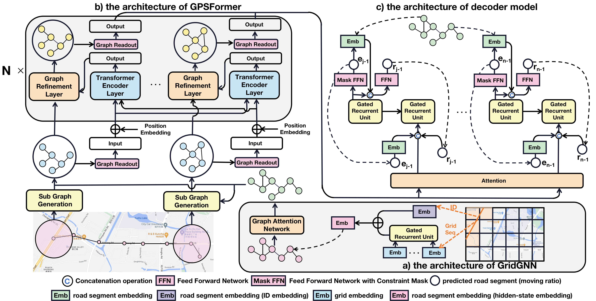

# RNTrajRec

<p align="center">

</p>

## About
Source code of the ICDE'23: [RNTrajRec: Road Network Enhanced Trajectory Recovery with Spatial-Temporal Transformer](docs/ICDE2023_RNTrajRec.pdf)

## Requirements
* `Python==3.6`
* `pytorch==1.8.0`
* `rtree==0.9.4`
* `GDAL==2.3.3`
* `networkx==2.3`
* `dgl==0.8.0.post2`
* `seaborn==0.11.2`
* `chinese-calendar==1.6.1`

## Data format

### OSM map format

Map from OSM that contains: `edgeOSM.txt nodeOSM.txt wayTypeOSM.txt`.

### Train data format

Train data has the following format: 

```
____ ROOT
  |____ train
    |____ train_input.txt
    |____ train_output.txt
  |____ valid
    |____ valid_input.txt
    |____ valid_output.txt
  |____ test
    |____ test_input.txt
    |____ test_output.txt
```

Note that:
* `{train/valid/test}_input.txt` contains raw GPS trajectory, `{train/valid/test}_output.txt` contains map-matched trajectory.
* The sample rate of input and output file for train and valid dataset in both raw GPS trajectory and map-matched trajectory need to be the same, as the downsampling process in done while obtaining training item.
* The sample rate of test input and output file is different, i.e. `test_input.txt` contain low-sample raw GPS trajectories and `test_output.txt` contain high-sample map-matched trajectories.
* We provide a toy dataset in Porto under `./data/Porto/` and OSM map for Porto under `./data/roadnet/`.

More information about data preprocessing can be found under `preprocess` fold.

## Training and Testing

* For training & testing with $\epsilon_\tau=\epsilon_\rho*8$ in Porto dataset, run the following command:

```
python -u multi_main.py --city Porto --keep_ratio 0.125 --pro_features_flag \
      --tandem_fea_flag --decay_flag
```

* For training & testing with $\epsilon_\tau=\epsilon_\rho*16$ in Porto dataset, run the following command:

```
python -u multi_main.py --city Porto --keep_ratio 0.0625 --pro_features_flag \
      --tandem_fea_flag --decay_flag
```

## Citations
If you find this repo useful and would like to cite it, citing our paper as the following will be really appropriate: <br>
```
@inproceedings{chen2023rntrajrec,
  title={RNTrajRec: Road network enhanced trajectory recovery with spatial-temporal transformer},
  author={Chen, Yuqi and Zhang, Hanyuan and Sun, Weiwei and Zheng, Baihua},
  booktitle={2023 IEEE 39th International Conference on Data Engineering (ICDE)},
  pages={829--842},
  year={2023},
  organization={IEEE}
}
```

## Call for Contribution and Pull Request

We encourage researchers to contribute to the project. Please feel free to create pull requests if we are working on data processing of GPS trajectory, like converting OSM maps to specific data formats or other spatial tools, or if you have insights about the training framework.
